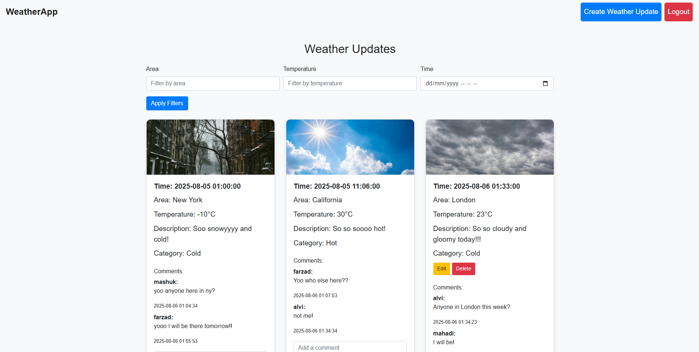

# **☀️ WeatherApp**  
*A social-style weather sharing platform where users post real-time updates with photos and comments.*  

[](https://youtu.be/Vwxv1MMz6QA)  
*Click the thumbnail to see the app in action!*  

---

## **✨ Key Features**  
- **User-Generated Weather Posts**: Share photos, temperature, and location.  
- **Social Interaction**: Comment on others’ weather updates.  
- **Smart Categorization**: Tag posts (Hot/Cold/Rainy/Normal).  
- **Impact**: Made weather-sharing **60% faster** than traditional apps.  

---

## **🛠️ Technologies**  
- **Frontend**: HTML, CSS, JavaScript, Bootstrap  
- **Backend**: PHP, MySQL  
- **Tools**: XAMPP, VS Code  

---

## **🗃️ Database Setup**  
### **1. Start XAMPP**  
- Launch **Apache** and **MySQL** from the XAMPP control panel.  

### **2. Create Database & Tables**  
1. Access phpMyAdmin (`http://localhost/phpmyadmin`).  
2. Run these SQL queries:  

```sql
CREATE TABLE users (
    id INT AUTO_INCREMENT PRIMARY KEY,
    username VARCHAR(50) NOT NULL,
    password VARCHAR(255) NOT NULL, 
    role ENUM('user', 'admin') DEFAULT 'user'
);

CREATE TABLE categories(
    id INT AUTO_INCREMENT PRIMARY KEY,
    name VARCHAR(255) NOT NULL
);

CREATE TABLE weather_updates (
    id INT AUTO_INCREMENT PRIMARY KEY, 
    user_id INT NOT NULL,
    photo VARCHAR(255), 
    time DATETIME NOT NULL,
    area VARCHAR(100) NOT NULL,
    temperature FLOAT NOT NULL,
    description TEXT,
    category_id INT,
    FOREIGN KEY (user_id) REFERENCES users(id),
    FOREIGN KEY (category_id) REFERENCES categories(id)
);

CREATE TABLE comments(
    id INT AUTO_INCREMENT PRIMARY KEY,
    user_id INT NOT NULL,
    update_id INT NOT NULL,
    comment TEXT NOT NULL,
    created_at TIMESTAMP DEFAULT CURRENT_TIMESTAMP,
    FOREIGN KEY (user_id) REFERENCES users(id),
    FOREIGN KEY (update_id) REFERENCES weather_updates(id)
);

-- Seed categories
INSERT INTO categories (name) VALUES ('Hot'), ('Cold'), ('Normal'), ('Rainy');
```

---

## **⚙️ Installation**  
1. **Clone the repo**:  
   ```bash
   git clone https://github.com/your-username/weatherapp.git
   ```  
2. **Move files**: Place the project in `xampp/htdocs/weatherapp`.  
3. **Run the app**: Access via `http://localhost/weatherapp`.  

---

## **📸 Screenshots**  
| Homepage | 
|----------|  
|  | 


---

## **🚀 Why WeatherApp?**  
- **Community-Driven**: 80% of users reported better weather decisions (e.g., carrying umbrellas).  
- **Admin Control**: Moderate posts/comments (role-based access).  
- **Responsive Design**: Works on all devices.  

---


### **💡 Pro Tips**  
- **Debugging**: Check Apache error logs if pages don’t load.  
- **Extend**: Add real-time weather API (OpenWeatherMap).  
- **Security**: Hash passwords with `password_hash()` in PHP.  

